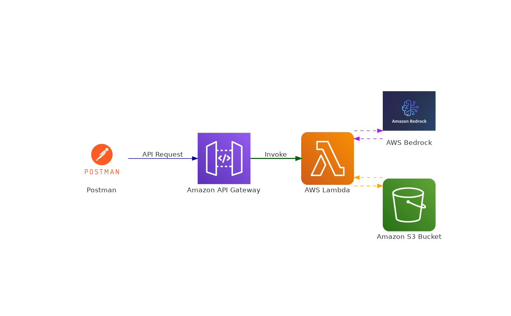

# End to End A.I Blog Generation with AWS Bedrock, AWS Lambda and S3 Storage

This project is designed to generate a blog using AWS Bedrock's language model and store it in an S3 bucket. The architecture involves AWS Lambda, API Gateway, Bedrock, S3, and Postman as the API client for testing. 

## Architecture

Below is the architecture diagram for the Blog Generation system:




- **Postman**: Used to test the API endpoint.
- **API Gateway**: Acts as the entry point, routing requests to the Lambda function.
- **AWS Lambda**: Executes the blog generation logic by invoking the Bedrock model and saves the output to S3.
- **AWS Bedrock**: Provides a large language model (LLM) used to generate the blog content.
- **Amazon S3**: Stores the generated blog as a text file.

## Prerequisites

- **AWS Account**: You need an AWS account to set up and configure the services.
- **AWS CLI**: [AWS CLI](https://aws.amazon.com/cli/) installed and configured.
- **Postman**: For sending test requests to the API.

## Setup

### 1. Configure Bedrock and S3

- **Amazon Bedrock**: Ensure Bedrock is enabled in your AWS account.
- **Amazon S3**: Create an S3 bucket (e.g., `aws_bedrock_v1`) where the generated blog text files will be stored.

### 2. Deploy Lambda Function

1. **Create a Lambda function** in AWS Lambda.
2. **Set up permissions** for the Lambda function:
   - Grant `S3` permissions to store generated blog content.
   - Grant `Bedrock` permissions to call the Bedrock model.
3. Upload the `lambda_function.py` code (below) to the Lambda function, ensuring any dependencies like `botocore` and `boto3` are properly installed.

### 3. Configure API Gateway

1. Set up an **API Gateway** to trigger the Lambda function.
2. Create a **POST** endpoint to handle incoming requests with `blogtopic` as a parameter in the body.
3. Enable **CORS** if testing with Postman.

### 4. Testing with Postman

- Use **Postman** to make a `POST` request to the API Gateway endpoint with JSON body input:
    ```json
    {
      "blogtopic": "Your Blog Topic Here"
    }
    ```

## Code

### Lambda Function Code

Below is the Lambda function code for generating the blog using Bedrock and storing it in S3:

```python
import json
import boto3 
import botocore.config 
from datetime import datetime

def blog_generate_using_bedrock(blogtopic: str) -> str:
    prompt = f"""
         <s>Human: Write a 200 words Blog on the topic {blogtopic}
         Assistant: 
    """

    body = {
        "prompt": prompt,
        "max_gen_len": 512,
        "temperature": 0.5,
        "top_p": 1.0,
    }

    try:
        bedrock = boto3.client("bedrock-runtime", region_name="ap-south-1",
                               config=botocore.config.Config(read_timeout=300, retries={'max_attempts':3}))

        response = bedrock.invoke_model(body=json.dumps(body), modelId="meta.llama3-70b-instruct-v1:0")
        response_content = response['body'].read()
        response_data = json.loads(response_content)
        blog_details = response_data['generation']

        return blog_details

    except Exception as e:
        print(f"Error occurred: {e}")
        return "Error occurred while generating the blog."

def save_blog_details_in_S3(s3_key, s3_bucket, generate_blog):
    try:
        s3_client = boto3.client('s3')
        s3_client.put_object(Bucket=s3_bucket, Key=s3_key, Body=generate_blog)
        print(f"Blog details saved successfully in S3 bucket: {s3_bucket} and Key: {s3_key}")
    except Exception as e:
        print(f"Error occurred while saving blog details in S3: {e}")

def lambda_handler(event, context):
    event = json.loads(event['body'])
    blogTopic = event['blogtopic']
    generate_blog = blog_generate_using_bedrock(blogTopic)

    if generate_blog:
        current_time = datetime.now().strftime("%H:%M:%S")
        s3_keys = f"blog-output/{current_time}.txt"
        s3_bucket = "aws_bedrock_v1"
        save_blog_details_in_S3(s3_keys, s3_bucket, generate_blog)
    else:
        print("No Blog was Generated!")

    return {
       'statusCode': 200,
       'body': json.dumps('Blog Generation completed successfully.')
    }

```
## How It Works

1. **Invoke Bedrock**: The Lambda function `blog_generate_using_bedrock` invokes AWS Bedrock to generate blog content based on the provided topic.
2. **Store in S3**: The generated blog content is stored in an S3 bucket in a text file with a timestamped key.
3. **Return Response**: The function responds with a success message upon completion.

## Error Handling

If any error occurs during the blog generation or saving process, the function logs the error and returns a failure message.

## Example Usage

To test the function, use Postman:

1. Make a `POST` request to your API Gateway endpoint.
2. Use the following JSON body:

    ```json
    {
      "blogtopic": "Machine Learning in 2024"
    }
    ```

The function will generate a blog, save it to S3, and respond with a confirmation message.

## Troubleshooting

- **Permissions**: Ensure the Lambda function has `S3` write permissions and `Bedrock` invoke permissions.
- **Timeouts**: Adjust the Lambda timeout settings to ensure Bedrock has enough time to generate the blog.

## License

This project is open source and available under the [MIT License](LICENSE).

## Author

This project is created and maintained by [Ankit Mishra](https://ankitmishra.live/).

You can find my GitHub profile here: [@ankitmishralive](https://github.com/your-github-id).

